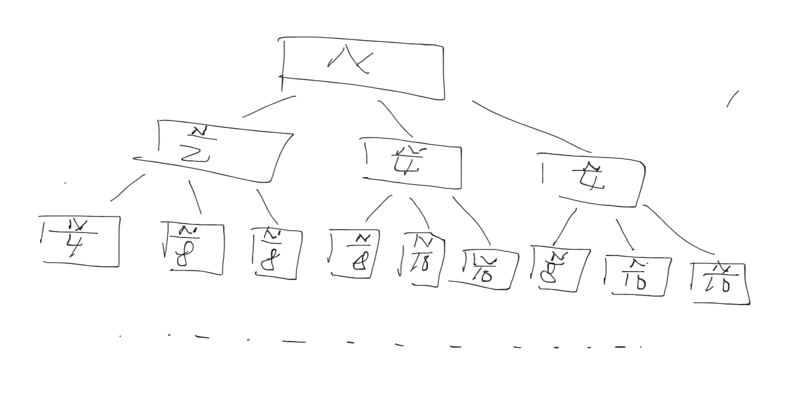
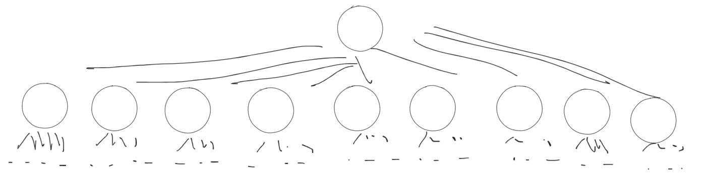

# 数据结构与算法  

> 参考教材 [algs4](https://algs4.cs.princeton.edu)  
  
## 渐进分析  
  
在计算机科学中，往往要对某个算法或设计的数据结构进行效率上的分析，该过程一般称为**算法分析**。  

**算法分析**（英语：Analysis of algorithm）是分析执行一个给定算法需要消耗的计算资源数量（例如计算时间，存储器使用等）的过程。  
  
而衡量这些的效率方法常见有理论分析、精确分析等等。这里主要讨论理论分析，理论分析采用的方法往往是渐近分析。  
  
**渐近分析**（asymptotic analysis），在数学分析中是一种描述函数在极限附近的行为的方法。而在计算机科学中，则是考虑给定算法在输入非常大数据集的时候其性能。  

$~~$  
看如下的一个例子，考虑一个函数，${\displaystyle f(n)}$，我们需要了解当$n$变得非常大的时候${\displaystyle f(n)}$的性质。  
  
令${\displaystyle f(n)=n^{2}+3n}$，在n特别大的时候，第三项比起第一项${\displaystyle n^{2}}$要小很多。  

于是对于这个函数，有如下断言：“${\displaystyle f(n)}$在${\displaystyle n\rightarrow \infty }$的情况下与${\displaystyle n^{2}}$**渐近等价**”，记作${\displaystyle f(n)\sim n^{2}}$。

在研究渐近行为的时候，保留最高阶项，即增长率最大的项。  

### 大Θ表示法和大O表示法  

实际评估算法的效率时，从时间和空间两个层次去进行评估，其都是关于问题规模对时间和空间资源的消耗。一般用**时间复杂度**和**空间复杂度**描述。  

对于空间，很容易理解到我们因为问题规模而消耗的内存就是其空间的效率，看如下的例子
  
``` Python
def max(arr):
    minIndex = 0
    for i in range(len(arr)):
        if arr[i] < arr[minIndex]:
            minIndex = i
    return minIndex
```

分析很容易知道获取一个数组的最大值的空间消耗为0，因为我们不需要创建额外的空间来解决这个问题
  
对于时间，测量其效率可以计时，使用`time`命令来测量其执行的总时间；但在这里，更偏好采用理论分析，即分析算法中指令执行的频度来估计算法的时间效率
  
> 对于实际测量会受指令集、架构、运行机器等影响，并不能严格的反映一个算法的效率
  
有以下步骤：

- 选取指令执行的频度中含高阶项的频度，忽略掉其他项  
- 渐近分析，将最低阶项并去掉高阶的常数项
  
看如下的例子：  
``` C  
for(int i = 0;i<N;i++)
    for(int j = i+1;j<N;j++)
        /*do something....*/
```

$~~~~$分析每条指令的执行次数，一层`for`循环是N次、二层`for`循环是$(N-1) + (N-2) + ... + 1 = \frac{N * (N-1) }{2}$。取最高阶项，则保留第二层`for`循环的频度，然后进行渐近分析，得到最终结果$N^2$。实际表示时间复杂度时，我们还会再给其带个帽子，看如下。

$~~$  

**大Θ表示法**： 对于$R(N)$，若有$f(N)$，使得存在两个不同的正整数$k_1、k_2$，有$k_1f(N)\le R(N) \le k_2f(N)$，则我们说$R(N)\in \Theta (f(N))$。其中$\Theta (f(N))$代表的是一类曲线簇，$f(N)$代表的是其渐近分析得到的函数。

**大O表示法**： 对于$R(N)$，若有$f(N)$，使得存在正整数$k_1$，有$R(N) \le k_1f(N)$，则我们说$R(N)\in O(f(N))$。其中$O(f(N))$代表的是一类曲线簇，$f(N)$代表的是其渐近分析得到的函数。
  
在用大$\Theta$表示法和大O表示法表示时间复杂度时，其$f(N)$都是相同的，唯一区别在于大O表示法包含的范围更广（因为其没有下界）。例如$N^2\in O(N^4)$，但是$N^2\notin \Theta(N^4)$。**也就是大O表示的是小于等于，而大$\Theta$则是约等于**。
  
$~~$  

下面介绍常见时间复杂度的分析方法，
  
- 非递归函数：这类时间复杂度的分析只需要找到含最大阶的代表性频度后渐近分析；另一种思路则是将数据进行几何上的转换，通过增加数据规模看几何改变程度。  
- 递归函数：这类的分析通过绘制递归树来分析，需要统计每层的执行频度，然后对所有层求和。  

> 有些时候无法找到最大阶数，而是任意变化的具体数，则这时只需要找最坏情况，见`case4`  

看下面的几个例子来加深理解：
  
`case1`：  
``` Java
 public void melo(int N){
   for(int i = 0; i < N*N; i++){
     System.out.println("Gelo is fruit pudding");
   }
   for(int i = 0; i < N*N*N; i++){
     System.out.println("Zo Two the Warriors");
   }
 }
```
分析得到最大频度为$N^3$，则其时间复杂度表示为$O(N^3)$。  

`case2`：
``` Java
public void grigobreath(int N){
     if(N==0){
       return;
     }
     for(int i  = 0; i < N; i++){
       System.out.println("Gul-great")
     }
     grigobreath(N * 1/2);
     grigobreath(N * 1/4);
     grigobreath(N * 1/4);
 }
```  

该函数明显是一个递归函数，肉眼观察不好分析，通过绘制递归树，得到如下：  

  

分析每一层的执行时间，容易知道都为$N$，树的层数又为$logN$（注意底数不重要，我们描述的是增长趋势）则总消耗时间为$N*logN$，则得到时间复杂度为$O(N*logN)$。  
  
`case3`：
``` Java
public void recu(int N){
    if(N == 0) return;
    recu(N-1);
    recu(N-1);
}

```  

绘制递归树，容易得到每层的执行时长为$2^{i}$，一共$N$层，对其求和，则总执行时间为$2^{N}-1$，则时间复杂度为$O(2^N)$。  

`case4`：
``` Java 
public static void f5(int N, int M) { 
    if (N < 10) { return; } 
    for (int i = 0; i <= N % 10; i++) { 
        f5(N / 10, M / 10); 
        System.out.println(M); 
    } 
} 
```  

这里我们绘制递归树时会遇到困难 -- 即无法得到每一层的个数，这时我们需要利用时间复杂度的概念，考虑最坏情况下的时间复杂度，则我们得到`N%10`的最大值为9，也就是每个结点都会产生9个子结点，如下：  

  

则对于第i层，其执行频度为$9^i$，一共$logN$层，对其求和，不难得出$9^{log N}$，则时间复杂度为$O(N)$  

## 数据结构  

### 链表  


### 并查集  


## 算法  