# PID
## § PID基础

**开环控制**：控制器单向输出值给被控对象，不获取被控对象的反馈，控制器对被控对象的执行状态**不清楚**。  


**闭环控制**：控制器输出值给被控对象，同时获取被控对象的反馈，控制器知道被控对象的执行状态，可以根据**反馈修改输出值**以优化控制。  

  

**PID**:$~~$是一种**闭环**控制算法，它动态改变施加到被控对象的**输出值**（Out），使得被控对象某一物理量的**实际值**（Actual），能够快速、准确、稳定地跟踪到指定的**目标值**（Target）  

`PID`各项分别为比例（Proportional）、积分（Integral）、微分（Differential）

> 理解：输出值是被控对象的实际驱动值，而实际值和目标值则是想要的值，输出值不要求和实际值和目标值相等  
$~~~~$同时输出值/实际值/目标值也不一定就是被控对象的属性，而是和其属性成线性的一个值就行  
例:电机速度和PWM波，实际控制PWM波而不是速度  
电机速度和编码器读取的值，实际值默认就是编码器值(可以转换为速度)  
电机位置和编码器值累加，实际值就是编码器值  

  
`PID`是一种基于**误差**（Error）调控的算法，其中规定：误差=目标值-实际值，`PID`的任务是**使误差始终为0**  

`PID`公式及方程: $~~$`PID`基于误差实现，所以需要获取误差来进行  

误差定义 :  
<center>$error(t) = Target(t) - Acutal(t)$</center>  
`PID`输出：  
<center>$out(t) = K_p*error(t) + K_i*\int_{0}^{t}error(t)dt + K_d*\frac{derror(t)}{dt}$</center>  

控制图解:  


  

详解:  
  
1)  $~~$该公式是经验公式\--工程中人们经过长期实践得出的经验方程,不考虑是怎么得到

2)  $~~$`error(t)`、`Target(t)`、`Actual(t)`都是当前t时刻的误差|目标|实际

3)  $~~$`Kp`、`Ki`、`Kd`各项作用  

**I.`Kp`**：比例项  

<center>$K_p*error(t)$</center>  

说明：比例项的输出值仅取决于**当前时刻**的误差，与历史时刻无关。当前存在误差时，比例项输出一个与误差呈正比的值，当前不存在误差时，比例项输出0

影响：`Kp`越大，比例项权重越大，**系统响应越快**,即达到目标的速度，但超调也会随之增加

> 调参时，当系统出现略微超调震荡时即可
  
$~~$  
缺点:$~~$纯比例项控制时，系统一般会存在稳态误差，`Kp`越大，稳态误差越小  
  
??? tip "`PID`稳态误差"  
    系统进入稳态时，实际值和目标值存在始终一个稳定的差值  
    稳态误差产生原因：  
    $~~~~$纯比例项控制时，若误差为0，则比例项结果也为0。**被控对象输入0时**，一般会自发地向一个方向偏移，产生误差。产生误差后，误差非0，比例项负反馈调控输出，当调控输出力度和自发偏移力度相同时，系统达到稳态  
    $~~$  
    判断是否会产生稳态误差：给被控对象输入0，判断被控对象会不会自发偏移  

    判断稳态误差的方向：给被控对象输入0，自发偏移方向即为稳态误差方向  

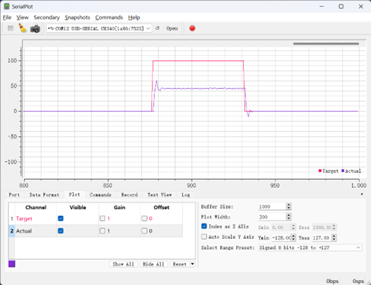  
<center><i>图(a)</i></center>  
  
$~~$  
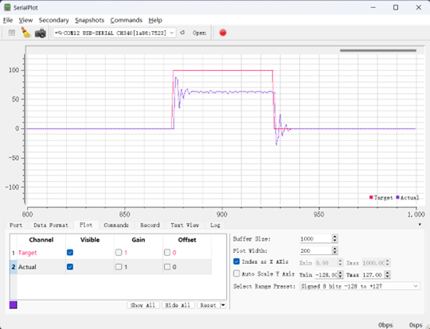  
<center><i>图(b)</i></center>

$~~~~$对于图a的`Kp`值为`0.5`，图b的`Kp`值为`1`；分析可以看到，当p越大时，斜率越大，即响应速度越快，同时会产生超调和震荡；同时可以看到存在稳态误差，即始终和目标值差一定值  
$~~$  
**ii.`Ki`**：积分项
<center>$K_i*\int_{0}^{t}error(t)dt$</center>  

说明：$~~$积分项的输出值取决于`0~t`所有时刻误差的积分，与历史时刻有关。积分项将历史所有时刻的误差累积，乘上积分项系数`Ki`后作为积分项输出值;积分项用于**弥补纯比例项产生的稳态误差**，若系统持续产生误差，则积分项会不断累积误差，直到控制器产生动作，让稳态误差消失

影响：`Ki`越大，积分项权重越大，稳态误差消失越快，但**系统滞后性**也会随之增加(响应速度)

> 调参时，调到出现震荡前的参数即为最佳参数  

$~~$  
缺点：当`Ki`过大时，会导致系统超调，产生震荡  
  
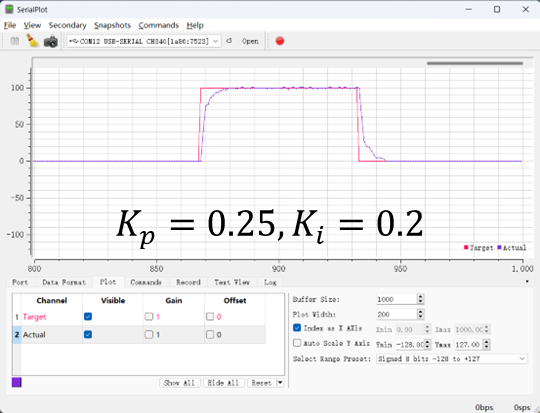  
<center><i>(图a)</i></center>  

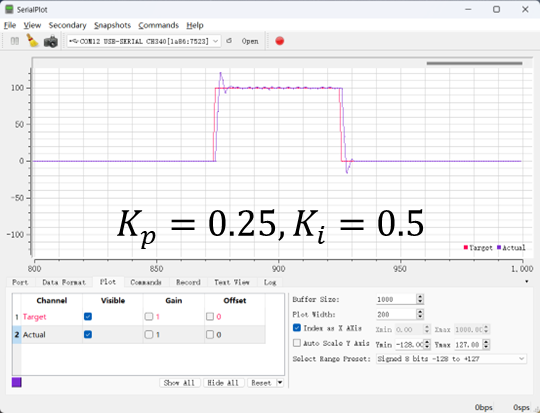  
<center><i>图(b)</i></center>  

对比图a和图b可以看出，增加`Ki`可以消除静态误差；在`Kp`相同的情况下，`Ki`过大时会造成系统的超调和震荡  
$~~$  
**iii.`Kd`**：微分项  

<center>$K_d*\frac{derror(t)}{dt}$</center>  

说明：$~~$微分项的输出值取决于**当前时刻误差变化的斜率**，与当前时刻附近误差变化的趋势有关。当误差急剧变化时，微分项会负反馈输出相反的作用力，阻碍误差急剧变化;斜率一定程度上反映了误差未来的变化趋势，这使得微分项具有
"预测未来，提前调控"的特性;**微分项给系统增加阻尼，可以有效防止系统超调，尤其是惯性比较大的系统**

影响：`Kd`越大，微分项权重越大，系统阻尼越大，但系统**卡顿**现象也会随之增加  

$~~$  
缺点：`Kd`过大时，微分项会导致系统卡顿

> `Kd`不是必需的--当`Actual`曲线在接近`Target`时其斜率若在增大，则需要添加`d`项，否则无意义

下面两张图分别为误差变化对`Kd`的影响；不同`Kd`的值对系统的影响  
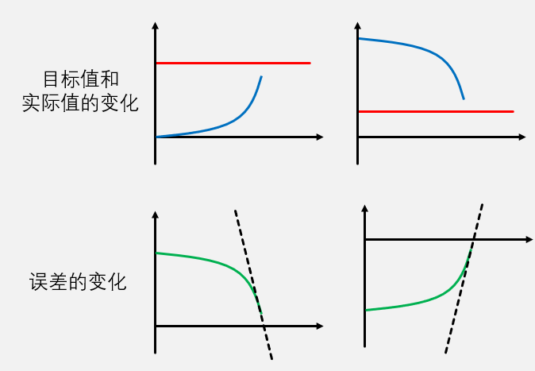  
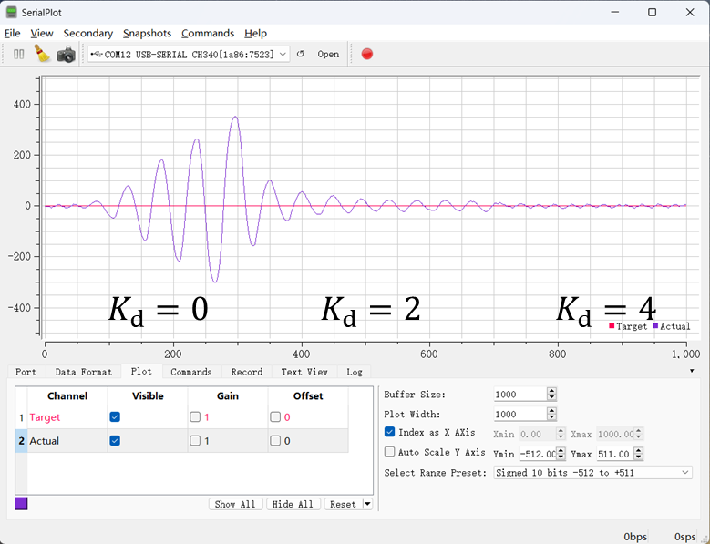  
<br></br>  
上面是连续的形式，在单片机中，需要对数据进行**离散化**，即下面的离散形式:

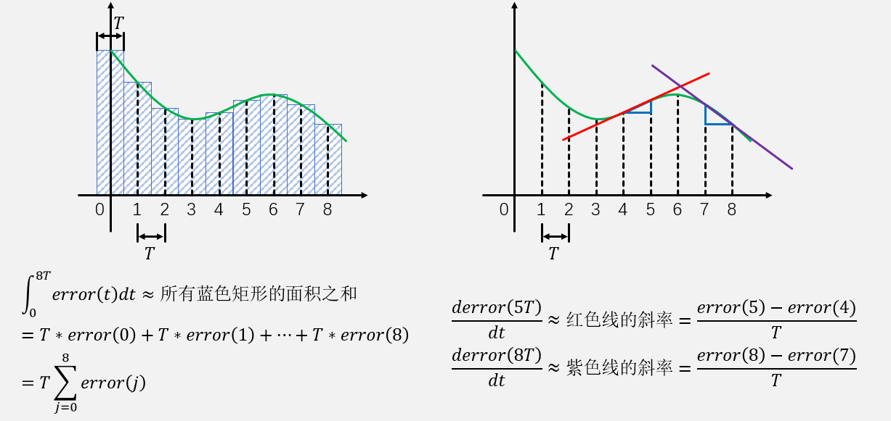  
  
<center>$out(k) = K_p*error(k) + K_i*T\sum_{j=0}^{k}error(j) + K_d*\frac{error(k)-error(k-1)}{T}$</center>  
合并$K_i*T$ 和 $K_d*\frac{1}{T}$ (都为常数) 得,  

<center>$out(k) = K_p*error(k) + K_i*\sum_{j=0}^{k}error(j) + K_d*[error(k) - error(k-1)]$</center>  

**注**:这里的`k`是第`k`次采样;合并前的`T`是采样时间(多久采样一次)  

<br></br>  

## § 位置式PID和增量式PID及程序实现  

※ 位置式`PID -- Out(k)`的输出是执行器需要达到的值  
<center>$out(k) = K_p*error(k) + K_i*\sum_{j=0}^{k}error(j) + K_d*[error(k) - error(k-1)]$</center>  
$~~$

※ 增量式`PID -- Out(k)`的值是执行器在原先的基础上+上该值  
<center>$out(k) = K_p*error(k) + K_i*\sum_{j=0}^{k}error(j) + K_d*[error(k) - error(k-1)]$</center>  
$~~$
<center>$out(k-1) = K_p*error(k-1) + K_i*\sum_{j=0}^{k-1}error(j) + K_d*[error(k) - error(k-2)]$</center>  
做差得，

<center>$\Delta out(k) = K_p*(error(k)-error(k-1)) + K_i*error(k) + K_d*(error(k)-2error(k-1)+error(k-2))$</center>  

**区别**:

◎ 位置式PID由连续形式PID直接离散得到，每次计算得到的是全量的输出值，可以**直接**给被控对象  

◎ 增量式PID由位置式PID推导得到，每次计算得到的是输出值的增量，如果直接给被控对象，**则需要被控对象内部有积分功能**  

◎ 增量式PID也**可在控制器内进行积分，然后输出积分后的结果**，此时增量式PID与位置式PID整体功能没有区别  

◎ 位置式PID和增量式PID计算时产生的中间变量不同，如果对这些变量加以调节，可以实现不同的特性  
<br></br>  

`PID`实现:


以上三个公式为基础，需要确定

`Target(k)`、`Actual(k)`、`error(k)`、`error(k-1)`、`error(k-2)`、`errorInt`、`Kp`、`Ki`、`Kd`、`out(k)` -- **结构体封装**  
``` C
//PID.h--模块文件，方便后面移植

typedef struct{
    float target,actual;
    float curError,lastError,lastlastError;//若不使用增量式pid则lastlasterror可以不使用
    float errorInt;//增量式没有积分项
    float Kp,Ki,Kd;
    float out;
    
    float outMax,outMin;//这里是输出限幅，就是防止控制器做出超过系统最大运行的行为
    
}PID_t;

//这里讲下如何创建并初始化PID_t
PID_t pid = {
    .target = val1,
    .Kp = p,
    .Ki = i,
    .Kd = d,
    .outMax = max,
    .outMin = min, //注意最后这里也要加,
};
```

**算法实现: `PID`更新算法 + `PID`实现算法**

**`PID`更新算法**  
主要有三种实现方式：

1)  `while(1) + Delay_ms` :
    直接写在主函数while循环中，但是该采样时间不严格为Delay_ms，每次采样时间不固定

2)  定时器中断`Handler` :
    放在定时器中断函数中，采样时间固定，但是严格要求内部程序执行时间小于定时时间
    (推荐)

3)  `while(1)` 标志位 + 定时器中断`Handler` :
    放在`while`循环中，但是用`flag`来决定是否执行，`flag`又定时中断来改变，采样时间不固定
``` C
//way1

int main(void){
    /*.....*/
    while(1){
        //数据获取-更新Actual的值
        //PID_Update
        //输出给控制器 & anotherTarget = currentOut
    }
}

//way2

int main(void){
    /*.....*/
    while(1){
        /*.....*/
    }
}
//中断函数放在main.c中，这样方便访问所有的驱动函数使用，方便数据的读取和使用
void Handler(void){
    //数据获取-更新Actual的值
    //PID_Update
    //输出给控制器 & anotherTarget = currentOut
}

//way3

int main(void){
    /*.....*/
    while(1){
        /*.....*/
        if(flag){
            flag = 0;
            //数据获取-更新Actual的值
            //PID_Update
            //输出给控制器 & anotherTarget = currentOut
        }
    }
}

void Handler(void){
    flag = 1;
    /*.....*/
}
```  
<br></br>  

**`PID`实现算法**：位置式`PID` + 增量式`PID`

直接写在`PID.c`中，定义为函数--方便`PID`算法改进时封装为不同函数用于不同`PID`的更新  
$1.~~out(k) = K_p*error(k)\ +K_i*\sum\limits_{j=0}^kerror(j) + K_d *[error(k)-error(k-1)]$  
$2.~~\Delta out(k) = K_p*(error(k)-error(k-1)) + K_i*error(k) + K_d*(error(k)-2error(k-1)+error(k-2))$  
``` C
//PID.c
#include "PID.h"
#include <math.h>

//位置式
void PID_Update(PID_t *pid){
    pid->lastError = pid->curError;
    pid->curError = pid->target - pid->actual;
    pid->errorInt = fabs(pid->Ki) < 1e-6 ? 0 : pid->errorInt + pid->curError;
    //这个是pid调参时Ki由0增加时防止积分过大导致系统出现问题
    
    pid->out = pid->Kp*pid->curError + pid->Ki*pid->errorInt + 
                                                                       pid->Kd*(pid->curError-pid->lastError);
    if(pid->out > pid->outMax) pid->out = pid->outMax;
    else if(pid->out < pid->outMin) pid->out = pid->outMin;
}

//增量式--控制器积分
void PID_Update(PID_t *pid){
    pid->lastlastError = pid->lastError;
    pid->lastError = pid->curError;
    pid->curError = pid->target - pid->actual;
    
    pid->out += pid->Kp*(curError-lastError)+pid->Ki*pid->curError+
                                               pid->Ki*(pid->curError-2*pid->lastError+pid->lastlastError)
    //注意这里的out是+=，相当于控制器积分了，要是被控对象自带积分器就不需要控制器积分
    if(pid->out > pid->outMax) pid->out = pid->outMax;
    else if(pid->out < pid->outMin) pid->out = pid->outMin;
}
```  
<br></br>  

这里讲下将二者结合--以`PID`更新算法二为例  
``` C
//默认timer时间都是1ms，这样可以使用分频器来达到想要的时间
void Handler(void){
    static uint16_t counter;
    counter++;//思考预分频器的原理
    if(counter >= val){ //这里的val值是需要自己确定的(不能太大也不能太小(小于硬件数据更新周期))--从大到小慢慢试
        //数据获取-更新Actual的值等
        //PID_Update
        //输出给控制器 & anotherTarget = currentOut
    }
}
```  
<br></br>  

**`PID改进算法`**: 针对`Ki`和`Kd`的缺点和输入输出进行改进

对于 `Ki` --> 积分限幅 积分分离 变速积分

对于 `Kd` --> 微分先行 不完全微分

对于 输入输出 --> 输出偏移 输入死区  
$~~$  

**1)**$~~$积分限幅  

$~~~~$如果执行器因为卡住、断电、损坏等原因不能消除误差，则误差积分会无限制加大，进而达到**深度饱和状态**，此时PID控制器会持续输出最大的调控力，即使后续执行器恢复正常，**`PID`控制器在短时间内也会维持最大的调控力**，直到误差积分从深度饱和状态退出,减慢了系统的响应速度  
$~~$  

实现方式:$~~$对<u>误差积分</u>或<u>积分项</u>输出进行判断，如果幅值**超过**指定阈值，则进行限制  
``` C
//误差积分限幅
void PID_Update11(PID_t *pid){
    pid->lastError = pid->curError;
    pid->curError = pid->target - pid->actual;
    pid->errorInt = fabs(pid->Ki) < 1e-6 ? 0 : pid->errorInt + pid->curError;
    
    if(pid->errorInt > pid->maxInt) pid->errorInt = pid->maxInt;
    else if(pid->errorInt < pid->minInt) pid->errorInt = pid->minInt;
    //这里maxInt和minInt的确定往往都是确定好Ki后用outMax/outMin去/Ki得到
    
    pid->out = pid->Kp*pid->curError + pid->Ki*pid->errorInt + 
                                                                       pid->Kd*(pid->curError-pid->lastError);
    if(pid->out > pid->outMax) pid->out = pid->outMax;
    else if(pid->out < pid->outMin) pid->out = pid->outMin;
}


//积分项限幅
void PID_Update12(PID_t *pid){
    pid->lastError = pid->curError;
    pid->curError = pid->target - pid->actual;
    pid->errorInt = fabs(pid->Ki) < 1e-6 ? 0 : pid->errorInt + pid->curError;
    
    pid->errorIntOut = Ki*pid->errorInt;//单独作为一项进行判断
    if(pid->errorIntOut > pid->maxInt) pid->errorIntOut = pid->maxInt;
    else if(pid->errorIntOut < pid->minInt) pid->errorIntOut = pid->minInt;
    
    pid->out = pid->Kp*pid->curError + pid->errorIntOut + 
                                                                       pid->Kd*(pid->curError-pid->lastError);
    if(pid->out > pid->outMax) pid->out = pid->outMax;
    else if(pid->out < pid->outMin) pid->out = pid->outMin;
}
```  
$~~$  

**2)**$~~$积分分离(`PD`控制器稳态问题)  

$~~~~$积分项作用一般位于调控后期，用来消除持续的误差，调控前期一般误差较大且**不需要积分项作用**，如果此时仍然进行积分，则调控进行到后期时，积分项可能已经累积了过大的调控力，这会导致超调

实现方式：对误差大小进行判断，如果误差绝对值**小于指定阈值**，则***加入***积分项作用，反之，则直接将误差积分清零或不加入积分项作用

> 一般用在PD控制器中，存在稳态误差，但是引入i项后又会超调  

``` C
void PID_Update2(PID_t *pid){
    pid->lastError = pid->curError;
    pid->curError = pid->target - pid->actual;
    pid->errorInt = fabs(pid->Ki) < 1e-6 ? 0 : pid->errorInt + pid->curError;
    
    pid->errorInt = fabs(pid->curError) < errorRange ? pid->errorInt : 0;//积分分离-阈值看稳态误差
    
    pid->out = pid->Kp*pid->curError + pid->Ki*pid->errorInt + 
                                                                       pid->Kd*(pid->curError-pid->lastError);
    if(pid->out > pid->outMax) pid->out = pid->outMax;
    else if(pid->out < pid->outMin) pid->out = pid->outMin;
}
```  
$~~$  

**3)**$~~$变速积分:  
积分分离的进阶，即积分强度会随着误差的增大而减小(而不是0%或100%)；
如果积分分离阈值没有设定好，被控对象正好在阈值之外停下来，则此时控制器完全没有积分作用，误差不能消除

控制器出现问题导致偏离误差大于阈值，则只有PD控制，导致后面回到target速度慢\--而变速积分保持积分的影响，**提高恢复速度**

实现方式:$~~$设计一个函数值随误差绝对值增大而减小的函数，函数值作为调整系数，用于调整误差积分的速度或积分项作用的强度  
> 该函数可以任意设置，只要满足反比就行  

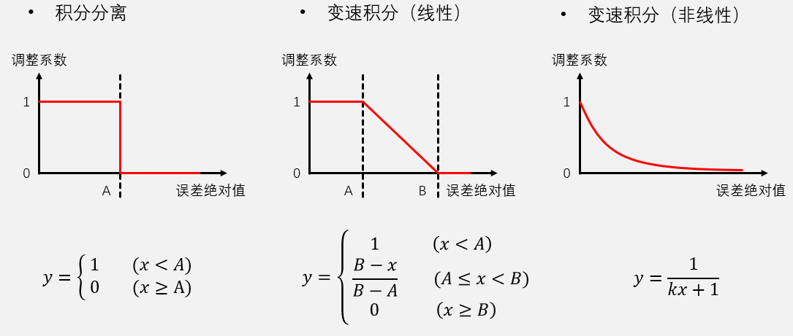  
``` C
//这里以非线性函数为例
void PID_Update3(PID_t *pid){
    pid->lastError = pid->curError;
    pid->curError = pid->target - pid->actual;
    pid->errorInt = fabs(pid->Ki) < 1e-6 ? 0 : pid->errorInt + pid->curError;
    
    pid->errorInt = 1/(k*curError+1) * pid->errorInt;//变速积分
    
    pid->out = pid->Kp*pid->curError + pid->Ki*pid->errorInt + pid->Kd*(pid->curError-pid->lastError);
    if(pid->out > pid->outMax) pid->out = pid->outMax;
    else if(pid->out < pid->outMin) pid->out = pid->outMin;
}
```  

$~~$  

**4)**$~~$微分先行:

微分项对误差进行微分，当目标值大幅度跳变时，误差也会瞬间大幅度跳变，这会导致微分项突然输出一个很大的调控力，如果**系统的目标值频繁大幅度切换**，则此时的微分项不利于系统稳定;

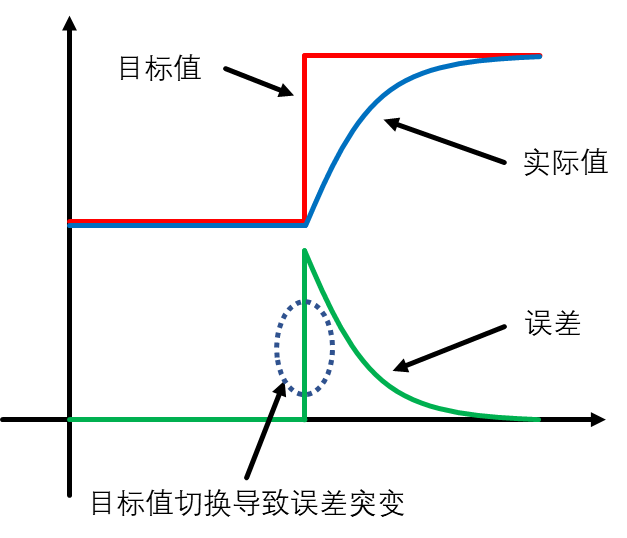  

实现方式:将对误差的微分替换为对**实际值的微分**$~~~~$$dout(k) = -K_d*(actual(k) - actual(k-1))$  

> 注：当系统频繁大幅度跳变时，误差也会大幅度跳变，这时的Kd会输出一个正向的驱动力(而不是负反馈\--正常应该是)\--导致系统不稳定。但是修改后会减慢到达Target的时间(正向驱动力对P作用的促进)  

``` C
void PID_Update4(PID_t *pid){
    pid->lastError = pid->curError;
    pid->curError = pid->target - pid->actual;
    pid->errorInt = fabs(pid->Ki) < 1e-6 ? 0 : pid->errorInt + pid->curError;
    
    pid->diffOut = - pid->Kd * (pid->actual-pid->lastActual);//微分先行，注意负号
    
    pid->out = pid->Kp*pid->curError + pid->Ki*pid->errorInt + pid->diffOut;
    if(pid->out > pid->outMax) pid->out = pid->outMax;
    else if(pid->out < pid->outMin) pid->out = pid->outMin;
}
```  
$~~$  

**5)**$~~$不完全微分:  

传感器获取的实际值**经常会受到噪声干扰**，而PID控制器中的**微分项对噪声最为敏感**，这些噪声干扰可能会导致微分项输出抖动，进而影响系统性能  
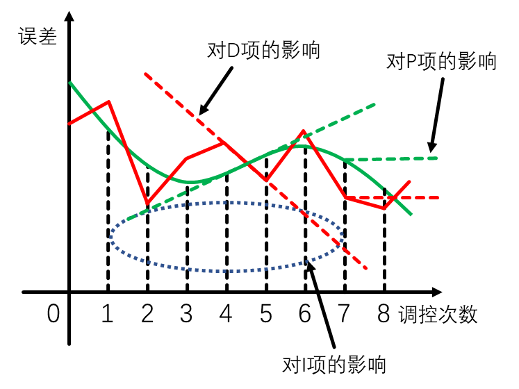  

实现方式：给微分项加入一阶惯性单元（低通滤波器）调整本次和上次微分的影响强度  
$dout(k) = (1-\alpha)*K_d*(error(k)-error(k-1)) + \alpha*dout(k-1)$  
``` C
void PID_Update5(PID_t *pid){
    pid->lastError = pid->curError;
    pid->curError = pid->target - pid->actual;
    pid->errorInt = fabs(pid->Ki) < 1e-6 ? 0 : pid->errorInt + pid->curError;
   
    static int float a = val;//某个比例值
    pid->diffOut = (1-a)*Kd*(curError-lastError) + a*diffOut;//不完全微分--右边的diffOut就是上次的
   
    pid->out = pid->Kp*pid->curError + pid->Ki*pid->errorInt + pid->diffOut;
    if(pid->out > pid->outMax) pid->out = pid->outMax;
    else if(pid->out < pid->outMin) pid->out = pid->outMin;
}
```  

$~~$  

**6)**$~~$输出偏移:  

对于一些启动需要一定力度的执行器，若**输出值较小，执行器可能完全无动作**，这可能会引起调控误差，同时会**降低**系统响应速度

实现方法:若输出值为0，则正常输出0，不进行调控；若输出值非0，则给输出值加一个固定偏移，跳过执行器无动作的阶段

$out(k)=\begin{cases}0 & out(k) = 0\\out(k)+offset & out(k) > 0\\out(k)-offset & out(k)<0 \end{cases}$  

> 用偏移代替了i项的作用，但是系统会在target来回震荡，这时需要结合输入死区  

``` C
void PID_Update6(PID_t *pid){
    pid->lastError = pid->curError;
    pid->curError = pid->target - pid->actual;
    pid->errorInt = fabs(pid->Ki) < 1e-6 ? 0 : pid->errorInt + pid->curError;
    
    pid->out = pid->Kp*pid->curError + pid->Ki*pid->errorInt + 
                                                                       pid->Kd*(pid->curError-pid->lastError);
    //输出偏移
    if(pid->out > 0) pid->out += offset;
    else if(pid->out <0) pid->out -= offset;
    
    if(pid->out > pid->outMax) pid->out = pid->outMax;
    else if(pid->out < pid->outMin) pid->out = pid->outMin;
}
``` 

$~~$  

**7)**$~~$输入死区:  

在某些系统中，输入的目标值或实际值有微小的噪声波动，或者系统有一定的滞后，这些情况可能会导致执行器在**误差很小时频繁调控**，不能最终稳定下来

实现方式:若误差绝对值小于一个限度，则固定输出0，不进行调控

$out(k)=\begin{cases}0 & |error(k)|<A\\out(k) & |error(k)| > A\end{cases}$  
``` C
void PID_Update7(PID_t *pid){
    pid->lastError = pid->curError;
    pid->curError = pid->target - pid->actual;
    pid->errorInt = fabs(pid->Ki) < 1e-6 ? 0 : pid->errorInt + pid->curError;
    
    pid->out = pid->Kp*pid->curError + pid->Ki*pid->errorInt + pid->Kd*(pid->curError-pid->lastError);
    
    if(fabs(curError) < deadZone) pid->out = 0;//输入死区--deadZone看稳态误差    
    if(pid->out > pid->outMax) pid->out = pid->outMax;
    else if(pid->out < pid->outMin) pid->out = pid->outMin;
}
```  
$~~$  

## § 多环串级`PID`及程序实现  

※ 多环串级`PID`:

`单环PID`只能对被控对象的一个物理量进行闭环控制，而当用户需要对被控对象的**多个维度物理量**（例如：速度、位置、角度等）进行控制时，则需要多个`PID`控制环路，即`多环PID`，多个`PID`串级连接，因此也称作`串级PID`.

优势:`多环PID`相较于`单环PID`，功能上，可以实现对更多物理量的控制，性能上，可以使系统拥有更高的准确性、稳定性和响应速度

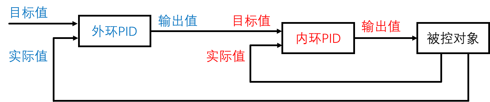  

注: `外环PID`的输出值作为`内环PID`的目标值；外环的输出值还可以作为增量和基准值+-后给`内环PID`(角度环)

``` C
//这里主要注意的点就是外环PID的输出值作为内环的目标值


//双环串级PID
void Handler(void){
    static int counter1,counter2;//这里的内环和外环的采样时间不用一致，但是保证内环更新周期小于外环
    counter1++,counter2++;
    
    if(counter1 >= time1){
        counter1 = 0;
        /*....*/
        //输出给执行器
    }
    if(counter2 >= time2){
        counter2 = 0;
        /*.....*/
        //pid1->target = pid2->out;
    }
    /*.....*/
}
```  

调参顺序上，先内环后外环  
$~~$  

## § `Kp`、`Ki`、`Kd`整定  

0. `Kp`、`Ki`、`Kd`的范围约等于输出值/输入值

1.  调参顺序`Kp`->`Kd`->`Ki` / `Kp`->`Ki`->`Kd`  

2.  速度环是PI控制 ；位置环是PD控制  

3.  
