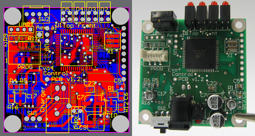
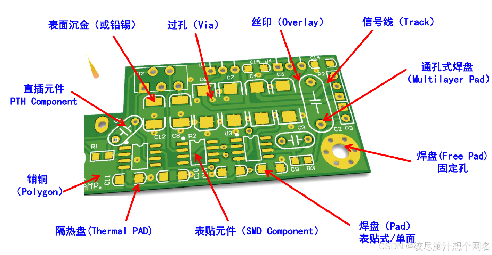
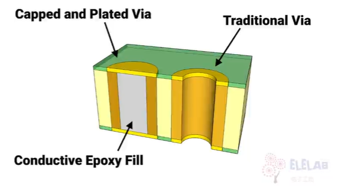
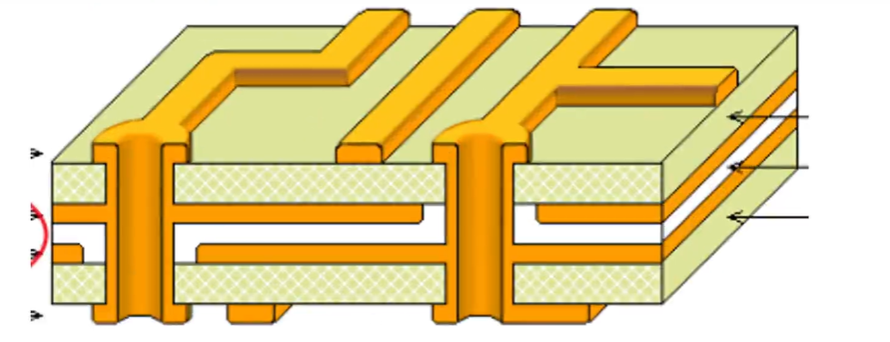
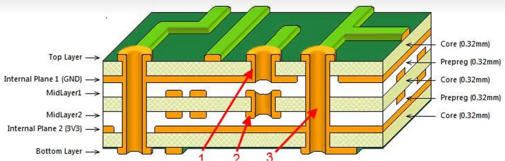
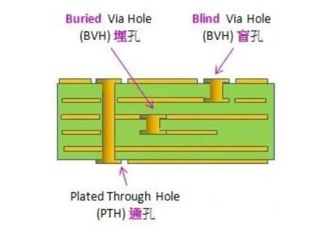
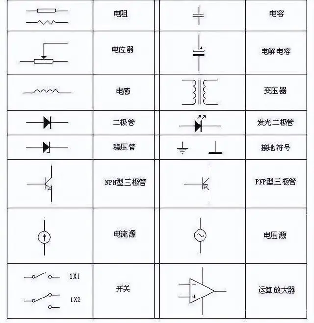
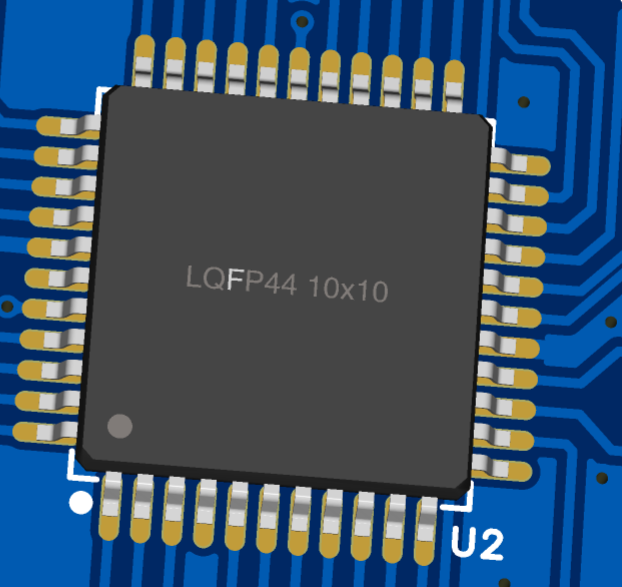

# PCB设计  

!!! warning "该笔记是主要围绕*用*，基本路线为熟练工具->抄板->半设计"  

## PCB基本知识  

**印刷电路板** :$~~$又称印制电路板，印刷线路板，常用英文缩写PCB（Printed circuit board）或PWB（Printed wire board），是电子器件的支撑体，在这其中有金属导体作为连接电子元器件的线路。 

byd一句话，就是用更小的导线将元器件连接起来，代替以前的大导线，集成度更高，更小巧  

  
$~~$  
电路板的材料构成: $~~$基板 + 金属涂层。基板以FR-4为常见(玻璃布（Woven glass）、环氧树脂)，金属涂层则为覆盖在基板上的层(减去法)，以铜锡金银较为常见  

**电路板的基本构成**  
一个完整的电路板主要由以下构成:  

- 线路与图面（Pattern）：线路是做为原件之间导通的工具，在设计上会另外设计大铜面作为接地及电源层。线路与图面是同时做出的。  

- 介电层（Dielectric）：用来保持线路及各层之间的绝缘性，俗称为基材  

- 孔（Through hole / via）：导通孔可使两层次以上的线路彼此导通，较大的导通孔则做为零件插件用，另外有非导通孔（nPTH）通常用来作为表面贴装定位，组装时固定螺丝用  

- 防焊油墨（Solder resistant /Solder Mask） ：并非全部的铜面都要吃锡上零件，因此非吃锡的区域，会印一层隔绝铜面吃锡的物质（通常为环氧树脂），避免非吃锡的线路间短路。根据不同的工艺，分为绿油、红油、蓝油等。  

- 丝印（Legend /Marking/Silk screen）：此为非必要的结构，主要的功能是在电路板上标注各零件的名称、代号、位置框、版本及商标等，方便组装后维修及辨识用。

- 表面处理（Surface Finish）：由于铜面在一般环境中很容易氧化，导致无法上锡（焊锡性不良），因此会在要吃锡的铜面上进行保护。保护的方式有喷锡（HASL）、化金（ENIG）、化银（Immersion Silver）、化锡（Immersion Tin）及有机保焊剂（OSP）等，方法各有优缺点，统称为表面处理。

下图为PCB板的元素构成，见下  

  
$~~$  
电路板的层数可以有1、2、4、6、8、...2n层，针对较复杂或多线路的电路时，保证了导线连接的不相交，下面简单讲下单层的**减去法**制作工艺  

**减去法**  

**减去法**（Subtractive），是利用化学品或机械将空白的电路板（即铺有完整一块的金属箔的电路板）上不需要的地方除去，余下的地方便是所需要的电路。  

- 丝网印刷：把预先设计好的电路图制成丝网遮罩，丝网上不需要的电路部分会被蜡或者不透水的物料覆盖，然后把丝网遮罩放到空白线路板上面，再在丝网上油上不会被腐蚀的保护剂，把线路板放到腐蚀液中，没有被保护剂遮住的部分便会被蚀走，最后把保护剂清理。  

- 感光板：把预先设计好的电路图制在透光的胶片遮罩上（最简单的做法就是用打印机印出来的投影片），同理应把需要的部分印成不透明的颜色，再在空白线路板上涂上感光颜料，将预备好的胶片遮罩放在电路板上照射强光数分钟，除去遮罩后用显影剂把电路板上的图案显示出来，最后如同用丝网印刷的方法一样把电路腐蚀。

- 刻印：利用铣床或激光雕刻机直接把空白线路上不需要的部分除去。  

人话：回想高中铜的蚀刻实验，就是将不要的铜蚀刻掉，剩下的铜构成电气连接关系  
$~~$  
下面针对多层板介绍一些基本概念  

**PCB的层叠结构**：  
层叠结构是指将不同功能的材料层层堆叠起来的物理结构，在印刷电路板（PCB）设计中尤其常见。其基本原理是将不同用途的铜箔导电层和绝缘介质（如玻璃纤维等）**交替堆叠**，以实现电流传输、信号布线、电源供应和信号屏蔽等多种功能。  

即对于层数大于等于2层的PCB板时，会涉及到层级结构  

- 二层板：主要是将基板打孔后，并镀铜将上下连接，以达到上下都有电气连接的特点，如下图过孔后再在基板上镀铜  

      
      

- 四层板：在二层板的基础上，将两个二层板用绝缘芯板隔离拼接再过孔，构成四层板。下图中白色的部分为芯板  

      

- 六层板：三个二层板拼接而成  

      

$~~$  
**通孔、埋孔、盲孔**  

- 通孔：通孔是我们最常见的一种导通孔，也是最简单的一种孔，成本比较低。对于通孔的简单理解可以参考，通==全部导通。  

- 盲孔：将PCB最外层（顶层或底层）电路和最邻近的内层以电镀孔连接，这种没有完全贯通的孔我们叫做盲孔，可以理解为盲人看不到对面。所以盲孔在PCB表面上可以看到有一个孔，但是另一面的同一个位置却没有与之相对应的孔。  

- 埋孔：PCB内层之间连接，但表层（顶层或底层）却看不到的孔。在制作内层的时候就需要先进行钻孔和电镀，然后再与其他层进行黏合。这种孔用于内层信号互连，适用于高密度和高速板卡设计。
    
      

**元件符号和封装**  

该概念是基础概念，不独属于多层板，能区分开来即可  

- 元件符号：原理图（其实就是电路图）中的元器件符号，例如高中物理的电阻、二极管、电容等等  

      

- 封装：封装是元件的实体。每个组件会放在电路板上。当它未焊接时，在电路板上就是丝印，它包含焊盘位置、引脚标记和轮廓等细节，以确保所有部件在组装过程中都能正确安装和工作。  

    如下图，分别未元器件未焊接和焊接后的封装  
        $~~$  
          
        $~~$  
          

    

## PCB设计流程  
以下流程为主，看图。这里简要概括一下  

1、如果没有需要的库，则先画库：器件，符号，封装。器件需要绑定符号和封装。

2、新建工程，放置器件在原理图并绘制原理图

3、原理图转PCB并绘制PCB

4、导出BOM和Gerber下单。

  

    

## PCB设计

!!! note "设计流程基于嘉立创EDA，从原理图绘制->PCB绘制说明一些新概念和设计注意事项"  

### 原理图绘制  

### PCB绘制
