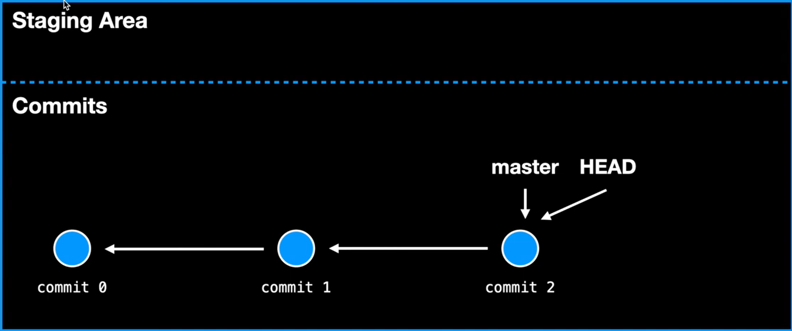
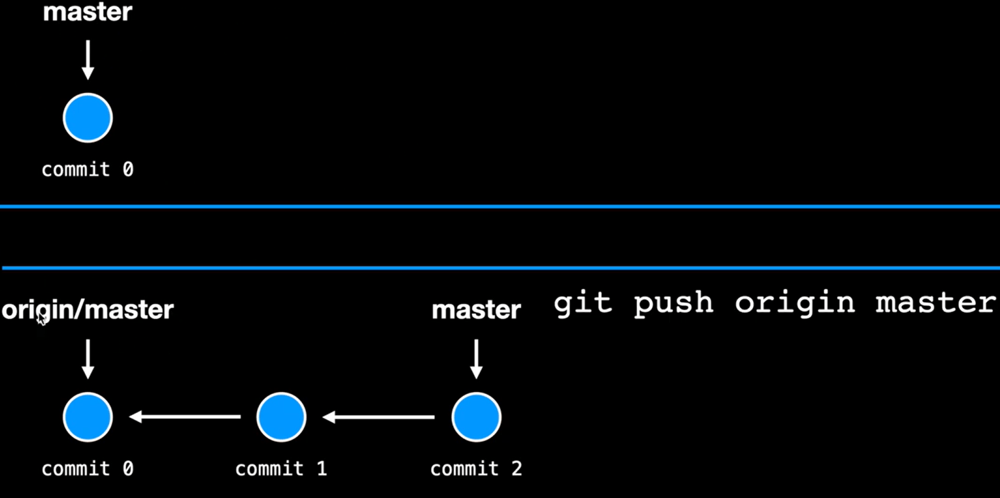

# Git   

**Git**，是一个分布式版本控制软件，广泛运用于对软件项目的版本控制。在软件开发的过程中可以追踪软件开发的进度，并回退版本。  
  
??? note "版本控制? 分布式?"  
    - **版本控制**：是维护工程蓝图的标准做法，其能够追踪工程蓝图从诞生一直到定案的过程。在计算机科学中，版本控制用于跟踪每次修改软件时的状态  
      
    $~~~~$类似每次修改一个程序后，为了防止后面的操作破坏当前的状态，我创建一个副本，每次修改一次创建一个副本，版本控制就是高阶的类似过程  
      
    - **分布式**：一种版本控制的方式，它允许软件开发者可以共同参与一个软件开发项目，但是不必在相同的网络系统下工作。其作法是在每个开发者电脑中复制一份完整的代码库以及完整历史。因此在无法连接网络时，仍可以进行软件的分支及合并，可以加速大部分的作业，增加此情形可以进行的工作，而且系统的代码库可以在多家电脑上备份，不需靠单一位置的备份。而多个位置的代码库再透过其他机制来达到同步。  
      
    $~~~~$一句话总结：云端用于同步，不同客户端可以不同，单独开发，后合并  


## 数据模型  
  
为了更好的使用下面的命令，适当的了解`git`的数据模型和实现细节是必要的  

### 快照与暂存区  
  
#### 快照  

像照片，某个顶层目录内的一组文件和文件夹的历史记录建模为一系列快照，即将文件目录下的当前状态保存记录下来，形成一个快照。用`SHA-1`哈希值来保存当前的快照(160bit大小)  
  
> 快照保存方式有很多，最简单的方法是直接复制当前的目录然后按修改时间取名，便创建了一个快照  

快照在Git中又称为`commit`，创建快照的过程也称为`commit`。一个快照除了跟踪的文件目录，还带有元数据 -- 作者 日期 说明等  
$~~$  
  
**关联快照与历史记录**  

Git中将不同的快照按照**有向无环图**组织在一起。其中，快照以节点的形式，这些快照之间相互称为**关联快照**；整个**有向无环图**称为历史记录；新快照指向旧快照。看起来像如下：  
  
``` 
o <- o <- o <- o
          ^
           \
            o <- o
```  
$~~$  
#### 暂存区  
  
创建快照时并不总是希望创建的快照是以当前的目录全部文件，而是想要选择性的创建快照，**暂存区**就用于存储需要创建的快照  
  
> 假想如下的场景：你在代码中添加了调试打印语句，并进行了错误修复；你希望提交错误修复，同时丢弃所有打印语句。  
  
下图为暂存区和快照间的关系图：  
  

### HEAD 和 main 
  
在Git中，可以很方便的对创建的快照进行跟踪，回溯到某个快照的状态下；HEAD指针就用于指示当前处于的快照，HEAD默认指向的是最新快照；而main指针永远指向最新的快照。  

??? question "如何切换到某个快照呢？或者某个快照的存储形式是什么？"  
    回顾上面的数据模型中，快照以`SHA-1`哈希值的方式来存储，切换快照时只需要切换到对应的`SHA-1`哈希即可。  

$~~~~$在Git中，除了HEAD和main指针外，还有**云端指针** -- 在分布式控制中，当本地仓库和远程仓库关联时，本地仓库会创建一个云端指针用于指向远程仓库的快照，只有当执行`push`命令时，才会移动云端指针和更新远程仓库的指针；当本地和远程同步时`pull`也会移动云端指针。  
  
看下图示例， 上`master`绑定的为`origin/master`，下`master`为`main`指针，更新发送在`push`后   
> `origin/master`表示的是`origin`仓库的`master`分支  
  
  
$~~$  

## 常用命令  
  
本章节主要介绍常用的`git`命令  
  
- `git init`：追踪当前的目录，创建一个`repo`来追踪  
- `git status`: 查看当前的`repo`是否有修改的文件  
- `git add [file]`：将修改的文件添加到暂存区中  
- `git commit [-m "message"]`：将暂存区的内容呈递`commit`，即创建快照`snap`  
- `git log `：查看`commit`记录  
  日志信息是顶层时间最新  
- `git checkout [hash-val] [-- file/dir]`：切换到某个`snap`/将文件或目录回溯到某个`snap`下  
> 注意该命令需要`status`是**clean**的  

分布式操作  
  
- `git clone [url]`：将远程仓库目录克隆到本地  
- `git remote add [local_name] [url]`：将远程的仓库和本地的仓库关联，其本地仓库可以不一定有  
- `git push [local_name] [branch]`：将`HEAD`指向的快照推送到远程的`branch`分支  
> 其历史的`commit`也会一并推送到远程  
- `git remote -v`：显示关联的本地仓库和远程仓库  
- `git pull [local_name] [branch]`：将远程仓库的某个分支拉取并尝试合并  